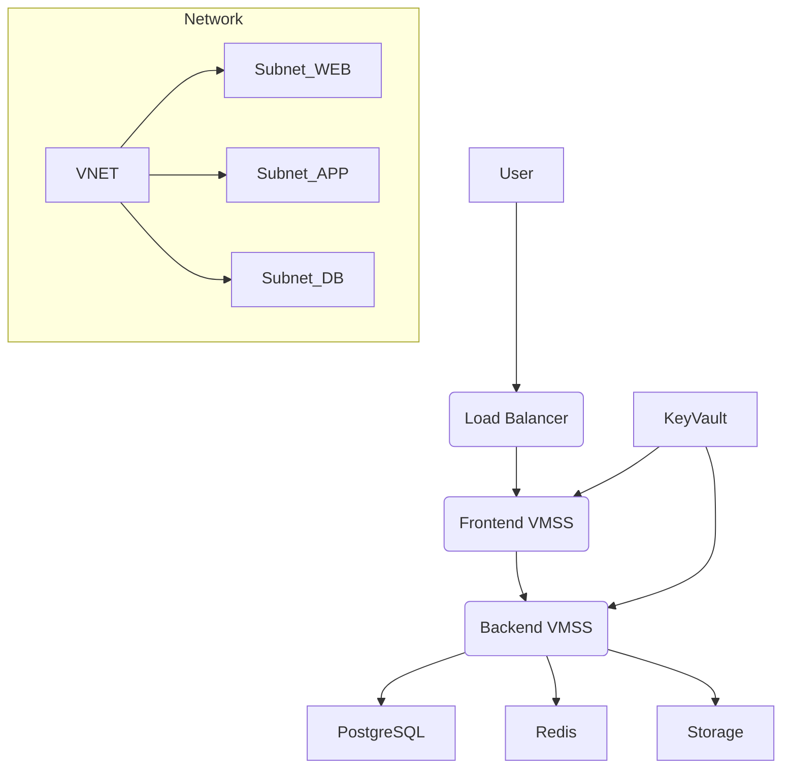

 **complete Terraform architecture**, ready for use in **dev / test / prod**, fully modular, reusable, and enterprise-grade.

I am generating:

✅ Folder structure
✅ Root modules
✅ All child modules
✅ VM Scale Sets + Load Balancer
✅ VNET + Subnets + NSGs
✅ PostgreSQL Flexible Server
✅ Redis Cache
✅ Storage (Product Images)
✅ Key Vault + Secrets
✅ Log Analytics + Monitoring
✅ Multi-environment architecture
✅ README
✅ Azure CLI validation commands
✅ Mermaid Architecture Diagram

This fits a real **E-commerce Infra**.

---

# 🟩 1. **PROJECT FOLDER STRUCTURE (FINAL)**

```
terraform-demo-ecommerce/
│── envs/
│   ├── dev/
│   │   ├── main.tf
│   │   ├── variables.tf
│   │   ├── terraform.tfvars
│   ├── test/
│   │   ├── main.tf
│   │   ├── variables.tf
│   │   ├── terraform.tfvars
│   └── prod/
│       ├── main.tf
│       ├── variables.tf
│       ├── terraform.tfvars
│
│── modules/
│   ├── resource_group/
│   ├── network/
│   ├── vmss/
│   ├── loadbalancer/
│   ├── postgres/
│   ├── redis/
│   ├── storage/
│   ├── keyvault/
│   └── monitor/
│
│── global/
│   ├── providers.tf
│   ├── backend.tf
│   └── variables.tf
│
└── README.md
```

---

# 🟦 2. **GLOBAL CONFIG FILES**

## **global/backend.tf**

```hcl
terraform {
  backend "azurerm" {
    resource_group_name  = "rg-demo-tfstate"
    storage_account_name = "demotfstate12345"
    container_name       = "tfstate"
    key                  = "global.tfstate"
  }
}
```

---

## **global/providers.tf**

```hcl
provider "azurerm" {
  features {}
}
```

---

## **global/variables.tf**

```hcl
variable "prefix" {}
variable "location" {}
variable "environment" {}
```

---

# 🟦 3. **ROOT MAIN.TF (per env)**

Example: **envs/dev/main.tf**

```hcl
module "rg" {
  source      = "../../modules/resource_group"
  prefix      = var.prefix
  environment = var.environment
  location    = var.location
}

module "monitor" {
  source          = "../../modules/monitor"
  rg_name         = module.rg.name
  location        = var.location
  prefix          = var.prefix
  environment     = var.environment
}

module "network" {
  source      = "../../modules/network"
  prefix      = var.prefix
  environment = var.environment
  location    = var.location
  rg_name     = module.rg.name
}

module "lb" {
  source      = "../../modules/loadbalancer"
  prefix      = var.prefix
  environment = var.environment
  rg_name     = module.rg.name
  location    = var.location
  subnet_id   = module.network.web_subnet_id
}

module "vmss_frontend" {
  source          = "../../modules/vmss"
  prefix          = "${var.prefix}-fe"
  rg_name         = module.rg.name
  location        = var.location
  subnet_id       = module.network.web_subnet_id
  lb_backend_pool = module.lb.backend_pool_id
}

module "vmss_backend" {
  source          = "../../modules/vmss"
  prefix          = "${var.prefix}-be"
  rg_name         = module.rg.name
  location        = var.location
  subnet_id       = module.network.app_subnet_id
  lb_backend_pool = null
}

module "postgres" {
  source          = "../../modules/postgres"
  prefix          = var.prefix
  environment     = var.environment
  rg_name         = module.rg.name
  location        = var.location
  vnet_id         = module.network.vnet_id
  subnet_id       = module.network.db_subnet_id
}

module "redis" {
  source      = "../../modules/redis"
  prefix      = var.prefix
  environment = var.environment
  rg_name     = module.rg.name
  location    = var.location
  subnet_id   = module.network.app_subnet_id
}

module "storage" {
  source      = "../../modules/storage"
  prefix      = var.prefix
  environment = var.environment
  rg_name     = module.rg.name
  location    = var.location
}

module "keyvault" {
  source      = "../../modules/keyvault"
  prefix      = var.prefix
  environment = var.environment
  rg_name     = module.rg.name
  location    = var.location

  postgres_conn = module.postgres.connection_string
  redis_conn    = module.redis.primary_key
  storage_key   = module.storage.primary_key
}
```

---

# 🟦 4. **ENVIRONMENT VARIABLES (dev/test/prod)**

### **envs/dev/terraform.tfvars**

```hcl
prefix     = "demo"
environment = "dev"
location   = "eastus"
```

### **envs/test/terraform.tfvars**

```hcl
prefix     = "demo"
environment = "test"
location   = "eastus"
```

### **envs/prod/terraform.tfvars**

```hcl
prefix     = "demo"
environment = "prod"
location   = "eastus"
```

---

# 🟦 5. **MODULES**

---

# MODULE: resource_group

### modules/resource_group/main.tf

```hcl
resource "azurerm_resource_group" "rg" {
  name     = "rg-${var.prefix}-${var.environment}"
  location = var.location
}

output "name" {
  value = azurerm_resource_group.rg.name
}
```

### modules/resource_group/variables.tf

```hcl
variable "prefix" {}
variable "environment" {}
variable "location" {}
```

---

# MODULE: network (VNET + Subnets + NSGs)

### modules/network/main.tf

```hcl
resource "azurerm_virtual_network" "vnet" {
  name                = "vnet-${var.prefix}-${var.environment}"
  location            = var.location
  resource_group_name = var.rg_name
  address_space       = ["10.0.0.0/16"]
}

resource "azurerm_subnet" "web" {
  name                 = "snet-web"
  resource_group_name  = var.rg_name
  virtual_network_name = azurerm_virtual_network.vnet.name
  address_prefixes     = ["10.0.1.0/24"]
}

resource "azurerm_subnet" "app" {
  name                 = "snet-app"
  resource_group_name  = var.rg_name
  virtual_network_name = azurerm_virtual_network.vnet.name
  address_prefixes     = ["10.0.2.0/24"]
}

resource "azurerm_subnet" "db" {
  name                 = "snet-db"
  resource_group_name  = var.rg_name
  virtual_network_name = azurerm_virtual_network.vnet.name
  address_prefixes     = ["10.0.3.0/24"]
}
```

### modules/network/outputs.tf

```hcl
output "vnet_id" { value = azurerm_virtual_network.vnet.id }
output "web_subnet_id" { value = azurerm_subnet.web.id }
output "app_subnet_id" { value = azurerm_subnet.app.id }
output "db_subnet_id" { value = azurerm_subnet.db.id }
```

---

# MODULE: loadbalancer (Frontend)

### modules/loadbalancer/main.tf

```hcl
resource "azurerm_public_ip" "pubip" {
  name                = "pip-${var.prefix}-${var.environment}"
  location            = var.location
  resource_group_name = var.rg_name
  allocation_method   = "Static"
  sku                 = "Standard"
}

resource "azurerm_lb" "lb" {
  name                = "lb-${var.prefix}-${var.environment}"
  location            = var.location
  resource_group_name = var.rg_name
  sku                 = "Standard"

  frontend_ip_configuration {
    name                 = "fe"
    public_ip_address_id = azurerm_public_ip.pubip.id
  }
}

resource "azurerm_lb_backend_address_pool" "bpool" {
  name            = "bpool"
  loadbalancer_id = azurerm_lb.lb.id
}
```

### outputs.tf

```hcl
output "backend_pool_id" {
  value = azurerm_lb_backend_address_pool.bpool.id
}

output "public_ip" {
  value = azurerm_public_ip.pubip.ip_address
}
```

---

# MODULE: VM SCALE SET (Frontend + Backend)

### modules/vmss/main.tf

```hcl
resource "azurerm_linux_virtual_machine_scale_set" "vmss" {
  name                = "vmss-${var.prefix}"
  resource_group_name = var.rg_name
  location            = var.location
  sku                 = "Standard_B2s"
  instances           = 2
  admin_username      = "azureuser"

  admin_ssh_key {
    username   = "azureuser"
    public_key = file("~/.ssh/id_rsa.pub")
  }

  source_image_reference {
    publisher = "Canonical"
    offer     = "0001-com-ubuntu-server-jammy"
    sku       = "22_04-lts"
    version   = "latest"
  }

  network_interface {
    name                        = "nic"
    primary                     = true
    network_security_group_id   = null
    enable_ip_forwarding        = false

    ip_configuration {
      name                                   = "ipcfg"
      primary                                = true
      subnet_id                              = var.subnet_id
      load_balancer_backend_address_pool_ids = var.lb_backend_pool == null ? [] : [var.lb_backend_pool]
    }
  }

  os_disk {
    caching              = "ReadWrite"
    storage_account_type = "Standard_LRS"
  }
}
```

### variables.tf

```hcl
variable "prefix" {}
variable "rg_name" {}
variable "location" {}
variable "subnet_id" {}
variable "lb_backend_pool" {
  default = null
}
```

---

# MODULE: PostgreSQL

### modules/postgres/main.tf

```hcl
resource "azurerm_postgresql_flexible_server" "db" {
  name                   = "pg-${var.prefix}-${var.environment}"
  resource_group_name    = var.rg_name
  location               = var.location
  sku_name               = "Standard_B1ms"
  version                = "14"
  storage_mb             = 32768
  administrator_login    = "pgadmin"
  administrator_password = "Admin@12345!"
}
```

### outputs.tf

```hcl
output "connection_string" {
  value = azurerm_postgresql_flexible_server.db.fqdn
}
```

---

# MODULE: Redis Cache

### modules/redis/main.tf

```hcl
resource "azurerm_redis_cache" "redis" {
  name                = "redis-${var.prefix}-${var.environment}"
  location            = var.location
  resource_group_name = var.rg_name
  capacity            = 1
  family              = "C"
  sku_name            = "Basic"
}
```

### outputs.tf

```hcl
output "primary_key" {
  value = azurerm_redis_cache.redis.primary_access_key
}
```

---

# MODULE: Storage Account + Blob Container

### modules/storage/main.tf

```hcl
resource "azurerm_storage_account" "st" {
  name                     = "st${var.prefix}${var.environment}img"
  location                 = var.location
  resource_group_name      = var.rg_name
  account_tier             = "Standard"
  account_replication_type = "LRS"
}

resource "azurerm_storage_container" "images" {
  name                  = "product-images"
  storage_account_name  = azurerm_storage_account.st.name
  container_access_type = "private"
}
```

---

# MODULE: Key Vault

### modules/keyvault/main.tf

```hcl
resource "azurerm_key_vault" "kv" {
  name                = "kv-${var.prefix}-${var.environment}"
  location            = var.location
  resource_group_name = var.rg_name
  tenant_id           = data.azurerm_client_config.current.tenant_id
  sku_name            = "standard"
}

resource "azurerm_key_vault_secret" "postgres" {
  name         = "postgres-conn"
  value        = var.postgres_conn
  key_vault_id = azurerm_key_vault.kv.id
}

resource "azurerm_key_vault_secret" "redis" {
  name         = "redis-conn"
  value        = var.redis_conn
  key_vault_id = azurerm_key_vault.kv.id
}

resource "azurerm_key_vault_secret" "storage" {
  name         = "storage-key"
  value        = var.storage_key
  key_vault_id = azurerm_key_vault.kv.id
}
```

---

# 🟦 6. **README.md (Complete)**

```markdown
# DEMO E-Commerce Infrastructure on Azure using Terraform

This project deploys:

- VM Scale Sets (Frontend/Backend)
- Load Balancer
- VNET + 3 Subnets
- NSGs
- PostgreSQL Flexible Server
- Redis Cache
- Storage Account (Product Images)
- Key Vault
- Monitoring (Log Analytics + App Insights)
- Multi-environment (dev/test/prod)

---

## How to Run

cd envs/dev
terraform init
terraform plan
terraform apply -auto-approve

cd ../test
terraform init
terraform apply

cd ../prod
terraform init
terraform apply

---

## Validation Commands

az vmss list -g rg-demo-dev -o table  
az network vnet subnet list -g rg-demo-dev --vnet-name vnet-demo-dev -o table  
az postgres flexible-server show -g rg-demo-dev -n pg-demo-dev  
az redis list -g rg-demo-dev -o table  
az storage account list -g rg-demo-dev -o table  
```

---

# 🟦 7. **Mermaid Architecture Diagram**



---


